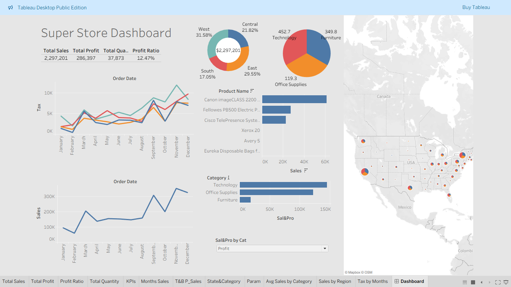

# 📊 Super Store Sales Dashboard – Tableau Project

Interactive Tableau dashboard analyzing Superstore sales data to visualize performance across regions, product categories, and profit trends.

---

## 📌 Dashboard Overview
- Total Sales, Profit, Quantity, and Profit Ratio KPIs  
- Sales by Category and Region  
- Top Products by Sales  
- Monthly Sales Trends  
- Map visualization showing regional distribution  

---

## 🛠️ Tools Used
- Tableau Desktop Public Edition  

---

## 🧠 Skills Demonstrated
- Data Visualization  
- Chart Design & Layout  
- KPI Representation  
- Geographic Mapping  

---

## 📊 Dashboard Screenshot

---

## 👤 Author
**Mohammad Anwar Ahmed**  
*Data Analyst – BI Developer*

